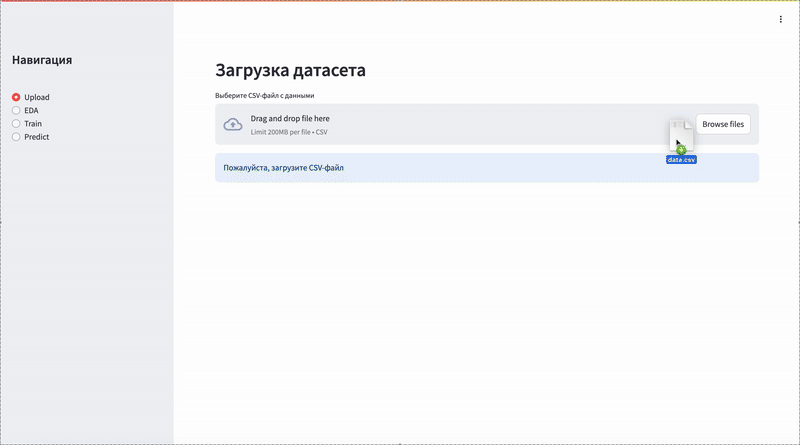
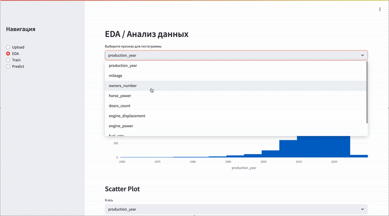
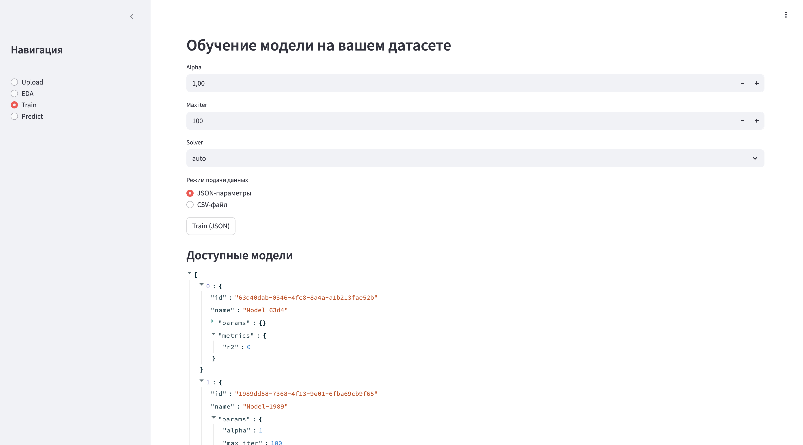
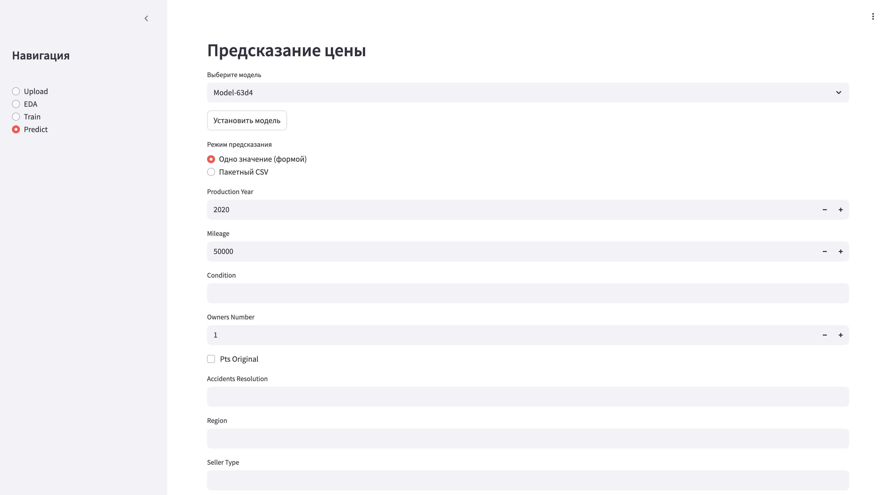
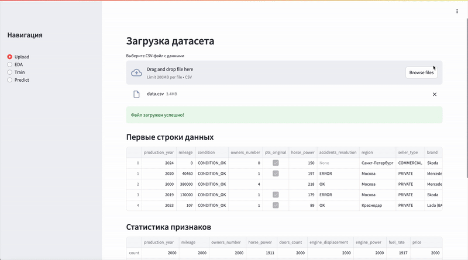

# Predicting the value of used cars
Model for predicting the value of used cars
by Четин Александр, Пожидаев Филипп, Гареев Равиль

## Инструкция по использованию всех реализованных функций в приложении

### Upload
Страница **Upload** позволяет загрузить данные в `.csv` формате и предварительно просмотреть их. 


### EDA
Позволяет сделать базовый **EDA** посмотреть на гистограммы, scatter-plot, матрицы корреляций.


### Train
Данная страница предназаначена для обучения модели и настройки параметров обучения.


### Predict
На текущей странице находится форма для ввода данных и кнопка предсказания; Есть возможность загрузкить `.csv` файл для пакетного предсказания и ручного ввода данных для предсказания одного значения.



### Демонстрация работы сервиса



## Процесс сборки и запуска приложения с помощью docker-compose

1. Убедитесь, что Docker и Docker Compose установлены.
2. В корне проекта выполните:

   ```bash
   docker-compose up --build -d
   ```
3. Откройте в браузере: \
   Streamlit: [http://localhost:8501](http://localhost:8501)
4. Просмотр логов: \
    С помощью Kibana: [http://localhost:5601](http://localhost:5601)
5. Остановка и удаление контейнеров:

   ```bash
   docker-compose down
   ```

